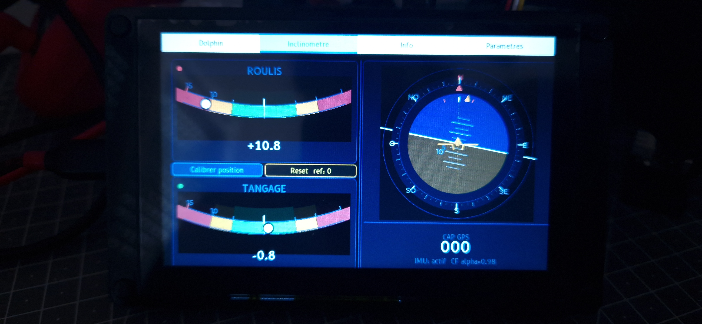
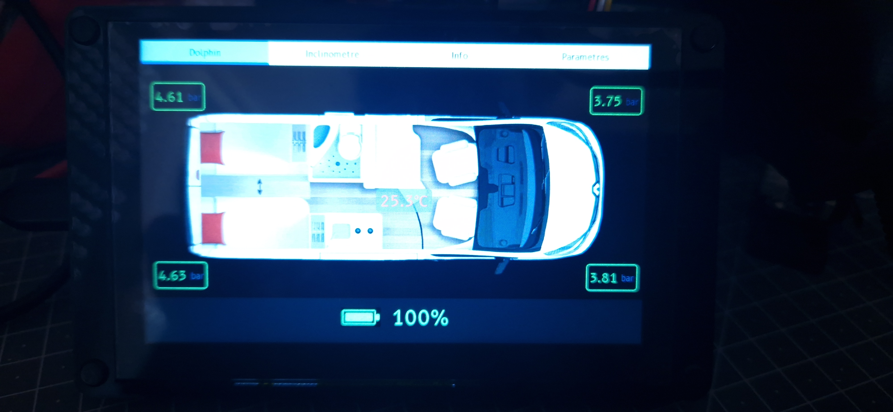
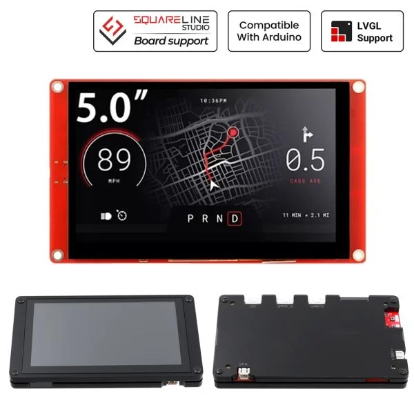

# esphome-Navigation
Esphome inclinometer and TPMS and based on CrowPanel 5.0"-HMI ESP32 Display 800x480 RGB TFT LCD

The communication between the 2 ESP is made directly via UDP IP<=>IP and don't realy on HomeAssistant. 

TPMS is made via esp-c6 zero (cc_186) which can do BLE 5.0. 
In the tpms.yaml there is 2 lines which are used to show MAC addresse of TPMS in logs. While MAC address are added to the cc-168.yaml, they can be commented.
    # - then:
    #     - lambda: tpms_dump_raw(x);

I've used the basic version, but i suggest using the Advanced with ESP32-C6 : https://www.elecrow.com/crowpanel-advance-5-0-hmi-esp32-ai-display-800x480-ips-artificial-intelligent-touch-screen.html
